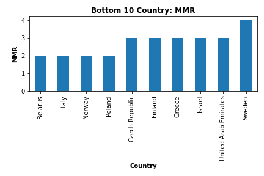
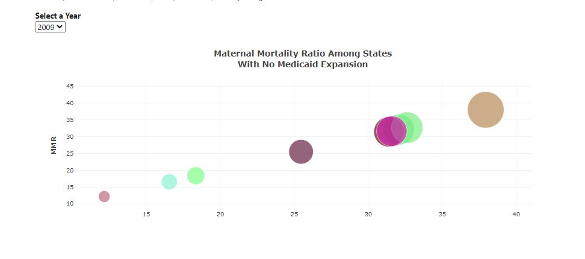

# Maternal Mortality: US and Global Perspectives

## Purpose of Project

The United States has the highest maternal mortality rate among 11 developed countries, and has seen rising deaths from 1987-2017 [source](https://www.ajmc.com/view/us-ranks-worst-in-maternal-care-mortality-compared-with-10-other-developed-nations).  Compared with any other wealthy nation, the United States spends the highest percentage of its gross domestic product on health care.  We discovered that as of 2017, Medicaid coverage was responsible for financing 43% of U.S. births but, covered medical services and income eligibility for Medicaid varied by state.  We wanted to explore by state if these variations affect maternal mortality rates.

## Project Overview

For this project, we developed an interactive dashboard for users to explore maternal mortality data globally and within the United States. Users will be able to visualize maternal mortality data alongside data for potentially related factors, such as access to health insurance and Medicaid.
We are focusing on factors at the state level because maternal mortality rates and healthcare policies and access vary widely between states.

## Objective

Our objective is for this dashboard to function in a way that allows for users to see patterns between maternal mortality rates and potential influencing factors.
For example, Does health insurance coverage affect maternal mortality rates? Does a state’s election of the medicaid expansion affect maternal mortality rates?  Are there any other factors that might affect maternal mortality?

## Data Sources Used

The data for this project was sourced from the following sources:

- UNICEF [Source](https://data.unicef.org/topic/maternal-health/maternal-mortality/)

- Insurance Coverage Data showing changes in Insurance Policy over time: [Source](https://www.kff.org/womens-health-policy/fact-sheet/womens-health-insurance-coverage-fact-sheet)

- Centers for Disease Control Wonder [Source](https://wonder.cdc.gov/)

- American Health Rankings: United Health Foundation [Source](https://www.americashealthrankings.org/explore/annual/measure/Outcomes/state/ALL)

- Medicaid Expansion [Source](https://data.medicaid.gov/Enrollment/State-Medicaid-and-CHIP-Applications-Eligibility-D/n5ce-jxme/data) 

## Data Processing & ETL

### **Extract**

- UNICEF:    Downloaded the latest data for Maternal Mortality Worldwide (2017).

- Centers for Disease Control Wonder:    Data on maternal deaths from 2009-19 in the US: death counts was queried on specific ICD codes for maternal deaths up to 42 days after delivery and late maternal deaths (defined by the WHO as death of a woman from direct or indirect obstetric causes).

- Kaiser Family Foundation:    Pulled health insurance coverage in the US for females aged 19-64 in the years 2009-2019.

- America's Health Rankings United Health Foundation:    Pulled report for overall health of women and children for 2019 as well as overall health outcomes by US state for years 2009-19.

### **Transform**

**Cleaning CDC data on maternal deaths and births in the U.S.**
- Pulled CDC data on maternal deaths according to causes of death listed above for years 2009-2019 as well as births (not all states reported each year).  We then merged separate deaths and births DataFrames with an inner join on the shared keys “State,” “State Code,” and “Year.” 
- Calculated the Maternal mortality ratio = (Number of maternal deaths / Number of live births) x 100,000, and added the ratio as a new column in the final DataFrame. 
- Exported cleaned data to a csv. 

**Cleaning Kaiser Data on Health Insurance Coverage of Females 19-64:**
- Collected data from the Kaiser Family Foundation site for years 2009-2019.
- Used fillna() function to remove NaN after confirming that totals for insurance coverage equaled 100%. and converted values for insurance coverage to percentages.
- Built new Dataframes with an added column for the year.
- Used pd.concat to combine DataFrames from each year from 2009-2019 and Sorted final dataframe by year and location. 
- Exported cleaned data to a csv. 

**Cleaning Health of Women and Children Data**
- Downloaded CSV of report data for 2019 
- Used .str.contains to select each relevant measure, storing as its own variable (For measures where demographic breakdowns were available) separated out that data and exported as their own CSVs
- Merged into one big CSV and Exported combined csv

**Cleaning overall Health Outcomes**
- Downloaded individual year CSVs in from years 2009-19 and read CSVs into Jupyter Notebook with Pandas, create individual dataframes
- Locate “Measure Names” pertinent to our information from .unique() list, investigate common entries throughout dataframes over time
- Replaced Measure Name for select values where name changed over time, select needed columns, reset indexes and used concat in order to combine dataframes
- Output dataframes to CSV

**Cleaning Maternal Mortality Global**
- Downloaded the latest data (2017) and read CSV into Jupyter Notebook with Pandas and create a dataframe
- Added columns (latitude, longitude) and based on location column, split item into 2 part and updated latitude and longitude columns
- Selected only columns that will be used and exported the final data to csv file in order to store in database

### **Load**

Within Jupyter Notebook, we exported cleaned CSVs into PostGres as tables in a unified database.  We then set an object and declared base in SQLAlchemy.  Next  table schemes were created corresponding to the individual CSV files.  We also created an engine and connection to the Postgres database and created the tables. A similar process was followed to create a local database: connection was made to SQLite file, tables were specified to be loaded, created, and binded to the local database.

- To help visualize connections, we created a database diagram via QuickDatabase

 
## Data Exploration ##

- The US has a unique place within peer countries for outcomes of women's overall and maternal health due to a variety of factors and there are specific challenges related to the US's healthcare system that could lead to difficulties caring for its population, particularly women.

- It was hypothesized that insurance coverage could affect health, and specifically women's health.  The period of 2009-19 was selected due to two specific changes in policy during this time period: in 2010 coverage was allowed for dependents up to age 26 and in 2014 the Affordable Care Act was implemented with expansion of Medicaid coverage made available to the states.

- Other health factors were also considered and investigated in order to evaluate insurance coverage's relative importance within the US health system.  It is important to remember there are some differences in reporting over time including between 2003 and 2017, where states were incrementally implementing pregnancy checkbox on death certificates with universal implementation by 2017.

### Statistical Analysis

#### Global

- South Sudan has the highest number of MMR and Belarus has the lowest number of MMR.

**Top 10 MMR** | **Bottom 10 MMR**
--------------------- | ---------------------
|

#### United States

- Overall statistical analysis was performed for selected data sets to visualize the dataframes created and to explore further the information that was cleaned.  We questioned which states might have the highest MMR per specific years identified. We then isolated various years to view what the mortality rate looked like across states.

- We also explored which states have the highest and lowest mortality ratio overall within the United States.  

**Top 10 MMR** | **Bottom 10 MMR**
--------------------- | ---------------------
|

## Flask Web Application

**Heroku Landing Page**

- Created the initial landing page to showcase global mortality ratio per 100,000 births.  The map shows their ranking according to the Maternal Mortality Ratio.  This map was created using the Javascript Library AnyChart

-Visualized the Mortality Ratio amongst the developed countries in the world.  Graph shows that the United States has the highest Rate of Maternal Mortality among the developed countries.

- Visualized the causes of Maternal Mortality as a pie graph that includes a drop down function with the ability to search by regions around the globe.  The pie graph highlights
the many complications that could lead to death during pregnancy and/or childbirth.

**United States: Affordable Care Act Page**

- Created a map of the United States that showcases the Maternal Mortality Ratio of each state across the selected time period, 2009-2019.  This map was created using the Javascript Library AnyChart

- Visualized the Maternal Mortality Ratio by state.  Drop down selection was included to allow for exploration of data for all states.  *There is no MMR for the Distric of Columbia and Puerto Rico*

- Visualized the comparison of insured and uninsured females by state, specifically focusing on medicaid insurance coverage.  Drop down selection was included to allow for exploration of data for all states.

- Visualized the Mortality Ratio of States that decided to not expand their medicaid coverage.  Drop down selection was included to allow for exploration of coverage (or lack there of) by year.

**United States: Ranked Measured Comparisons**

-Visualized how the states with the highest and lowest mortality rates compared against related health care measures.

Web application is deployed on Heroku: [Maternal Mortality Heroku App](https://maternal-mortality-project.herokuapp.com/)

Source code is available on GitHub: [GitHub Source Code](https://github.com/abpuccini/project2-maternal-mortality)

## Libraries & Tools Used

Python Version 3 | Jupyter Notebook | Pandas | PostgreSQL | Flask | SQLAlchemy | Plotly | Bootstrap | Anychart | Chrome Table Capture

## © Contributor

Team Member |  |  | 
-- | :-: | :-: | :-
<b>Akilah Hunte</b> |  |  | 
<a><b>Atcharaporn B Puccini </b></a> |  |  | 
<a><b>Austin Cole </b></a> |  |  | 
<a><b>Chahnaz Kbaisi </b></a> |  |  | 
<a><b>Lee Prout </b></a> |  |  | 
<a><b>Shay O'Connell </b></a> |  |  | 
<a><b>Wesley Lo </b></a> |  | | 