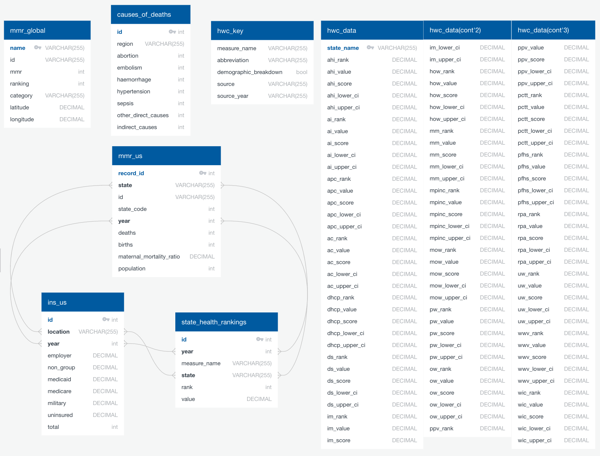
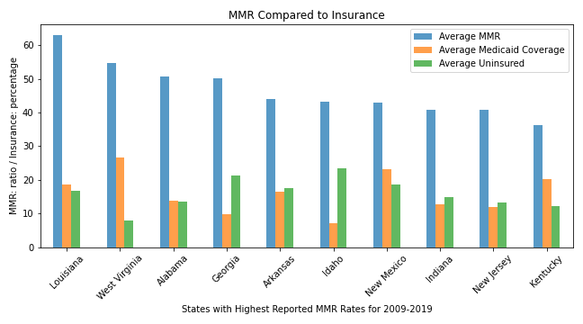
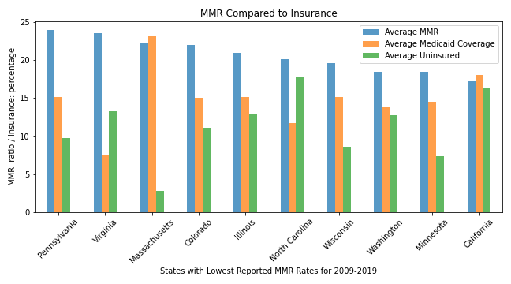
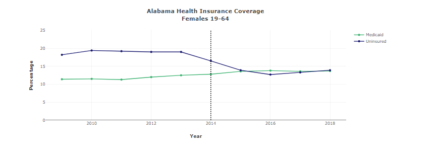
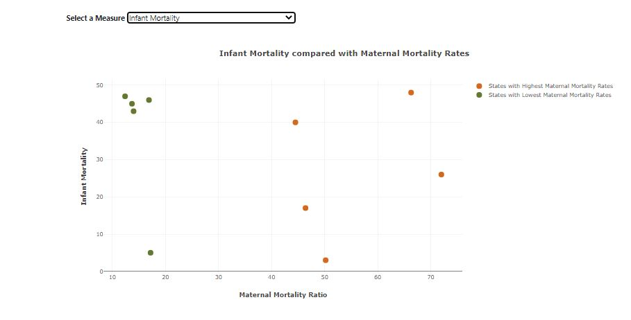

# Maternal Mortality: US and Global Perspectives

## Table of Contents

1. [Purpose of Project](#purpose-of-project)
2. [Project Overview](#project-overview)
3. [Objective](#objective)
4. [Data Sources](#data-sources)
5. [Data Processing and ETL](#data-processing-and-etl)
    - [Extract](#extract)
    - [Transform](#transform)
    - [Load](#load)
6. [Data Exploration](#data-exploration)
7. [Statistical Analysis](#statistical-analysis)
    - [Global](#global)
    - [United States](#united-states)
8. [Machine Learning](#machine-learning)
    - [Purpose](#purpose)
    - [Model Creation & Selection](#model-creation-and-selection)
    - [10-Year Forecast](#10-year-forecast)
9. [Flask Web Application](#flask-web-application)
    - [Home Page](#home-page)
    - [United States: Affordable Care Act Page](#united-states-affordable-care-act-page)
    - [United States: Ranked Measured Comparisons Page](#united-states-ranked-measured-comparisons-page)
    - [Machine Learning Models Page](#machine-learning-models-page)
    - [Machine Learning Playground Page](#machine-learning-playground-page)
    - [Machine Learning 10-Year Forecast Page](#machine-learning-10-Year-Forecast-Page)
    - [News and Articles Page](#news-and-articles-page)
    - [Methodology Page](#methodology-page)
    - [About Us Page](#about-us-page)
10. [Library and Tools](#libraries-and-tools)
11. [Contributors](#contributors)

## Purpose of Project

The United States has the highest maternal mortality rate among 11 developed countries, and has seen rising deaths from 1987-2017 [source](https://www.ajmc.com/view/us-ranks-worst-in-maternal-care-mortality-compared-with-10-other-developed-nations).  Compared with any other wealthy nation, the United States spends the highest percentage of its gross domestic product on health care.  We discovered that as of 2017, Medicaid coverage was responsible for financing 43% of U.S. births but covered medical services and income eligibility for Medicaid varied by state.  We wanted to explore by state if these variations affect maternal mortality rates.

## Project Overview

For this project, we developed an interactive dashboard for users to explore maternal mortality data globally and within the United States. Users will be able to visualize maternal mortality data alongside data for potentially related factors, such as access to health insurance and Medicaid.
We are focusing on factors at the state level because maternal mortality rates and healthcare policies and access vary widely between states.

## Objective

Our objective is for this dashboard to function in a way that allows for users to see patterns between maternal mortality rates and potential influencing factors.
For example, Does health insurance coverage affect maternal mortality rates? Does a state’s election of the medicaid expansion affect maternal mortality rates?  Are there any other factors that might affect maternal mortality?

## Data Sources

The data for this project was sourced from the following sources:

- UNICEF [Source](https://data.unicef.org/topic/maternal-health/maternal-mortality/)

- Insurance Coverage Data showing changes in Insurance Policy over time: [Source](https://www.kff.org/womens-health-policy/fact-sheet/womens-health-insurance-coverage-fact-sheet)

- Centers for Disease Control Wonder [Source](https://wonder.cdc.gov/)

- American Health Rankings: United Health Foundation [Source](https://www.americashealthrankings.org/explore/annual/measure/Outcomes/state/ALL)

- Medicaid Expansion [Source](https://data.medicaid.gov/Enrollment/State-Medicaid-and-CHIP-Applications-Eligibility-D/n5ce-jxme/data) 

## Data Processing and ETL

### **Extract**

- UNICEF:    Downloaded the latest data for Maternal Mortality Worldwide (2017).

- Centers for Disease Control Wonder:    Data on maternal deaths from 2009-19 in the US: death counts were queried on specific ICD codes for maternal deaths up to 42 days after delivery and late maternal deaths (defined by the WHO as death of a woman from direct or indirect obstetric causes).

- Kaiser Family Foundation:    Pulled health insurance coverage in the US for females aged 19-64 in the years 2009-2019.

- America's Health Rankings United Health Foundation:    Pulled report for overall health of women and children for 2019 as well as overall health outcomes by the US state for years 2009-19.

### **Transform**

**Cleaning CDC data on maternal deaths and births in the U.S.**
- Pulled CDC data on maternal deaths according to causes of death listed above for years 2009-2019 as well as births (not all states reported each year).  We then merged separate deaths and births DataFrames with an inner join on the shared keys “State,” “State Code,” and “Year.” 
- Calculated the Maternal mortality ratio = (Number of maternal deaths / Number of live births) x 100,000, and added the ratio as a new column in the final DataFrame. 
- Exported cleaned data to a csv. 

**Cleaning Kaiser Data on Health Insurance Coverage of Females 19-64:**
- Collected data from the Kaiser Family Foundation site for years 2009-2019.
- Used fillna() function to remove NaN after confirming that totals for insurance coverage equaled 100%. and converted values for insurance coverage to percentages.
- Built new Dataframes with an added column for the year.
- Used pd.concat to combine DataFrames from each year from 2009-2019 and Sorted final dataframe by year and location. 
- Exported cleaned data to a csv. 

**Cleaning Health of Women and Children Data**
- Downloaded CSV of report data for 2019 
- Used .str.contains to select each relevant measure, storing as its own variable (For measures where demographic breakdowns were available) separated out that data and exported as their own CSVs
- Merged into one big CSV and Exported combined csv

**Cleaning overall Health Outcomes**
- Downloaded individual year CSVs in from years 2009-19 and read CSVs into Jupyter Notebook with Pandas, create individual dataframes
- Locate “Measure Names” pertinent to our information from .unique() list, investigate common entries throughout dataframes over time
- Replaced Measure Name for select values where name changed over time, select needed columns, reset indexes and used concat in order to combine dataframes
- Output dataframes to CSV

**Cleaning Maternal Mortality Global**
- Downloaded the latest data (2017) and read CSV into Jupyter Notebook with Pandas and create a dataframe
- Added columns (latitude, longitude) and based on location column, split item into 2 part and updated latitude and longitude columns
- Selected only columns that will be used and exported the final data to csv file in order to store in database

### **Load**

Within Jupyter Notebook, we exported cleaned CSVs into PostGres as tables in a unified database.  We then set an object and declared base in SQLAlchemy.  Next  table schemes were created corresponding to the individual CSV files.  We also created an engine and connection to the Postgres database and created the tables. A similar process was followed to create a local database: connection was made to SQLite file, tables were specified to be loaded, created, and binded to the local database.

- To help visualize connections and see the composition of dataset, we created a database diagram via QuickDatabase

 
## Data Exploration

- The US has a unique place within peer countries for outcomes of women's overall and maternal health due to a variety of factors and there are specific challenges related to the US's healthcare system that could lead to difficulties caring for its population, particularly women.

- It was hypothesized that insurance coverage could affect health, and specifically women's health.  The period of 2009-2019 was selected due to two specific changes in policy during this time period: in 2010 coverage was allowed for dependents up to age 26 and in 2014 the Affordable Care Act was implemented with expansion of Medicaid coverage made available to the states.

- Other health factors were also considered and investigated in order to evaluate insurance coverage's relative importance within the US health system.  It is important to remember there are some differences in reporting over time including between 2003 and 2017, where states were incrementally implementing pregnancy checkbox on death certificates with universal implementation by 2017.

## Statistical Analysis

### Global

- As the bar charts presented below, **South Sudan** has the highest number of MMR and **Belarus** has the lowest number of MMR.

**Top 10 MMR** | **Bottom 10 MMR**
--------------------- | ---------------------
|

- Comparing among **developed countries** as the bubble chart presented below, **United States** has the highest number of MMR and **Norway** has the lowest number of MMR. According to Maternal mortality and maternity care in the United States compared to 10 other developed countries studied by Tikkanen and others, the U.S. is the only country that will not guarantee the accessibility to home visit or paid parental leave after giving birth. Also, the shortage of maternity care providers affects the rate significantly.

- Based on **worldwide** causes-of-deaths data presented as pie charts below, *excluding indirect causes*, Haemorrhage has a higher percentage than the other causes. 

  

- Comparing between developed, developing and under-developing (Africa) regions, *excluding indirect causes*, Haemorrhage (green area in chart) is 1.5 to 2 times more in the developing region and under-developing region than the developed region. As a result of healthcare accessibility and medical advancement, there is a lower rate of Haemorrhage in the developed region as the charts presented below.

  

### United States

- Overall statistical analysis was performed for selected data sets to visualize the dataframes created and to explore further the information that was cleaned.  We questioned which states might have the highest MMR per specific years identified. We then isolated various years to view what the mortality rate looked like across states.

- We also explored which states have the highest and lowest mortality ratio overall within the United States.  

**Top 10 MMR** | **Bottom 10 MMR**
--------------------- | ---------------------
|

## Machine Learning

### Purpose

Maternal Mortality Rates have continued to increase in the United State despite improvements in health care and quality of life. This project examines the impact of various demographic factors, existing health conditions, and differences in access to care on maternal mortality rates during the period of 2009 to 2019 and asks by identifying which factors contribute to an increased MMR, can we create a functional model to predict risk?

In order to maximize our chances at creating a smart machine learning model, we decided that we needed more data to train it with, so we expanded the data we originally collected by diving deeper into race for MMR, and gathered more healthcare measure data similar to what we used for the Ranked Comparison page featured on our app. 

We collected health measure data from America’s Health Rankings for 28 measures across each state from 2009-2019. We used pandas to select the values we wanted, and created one comprehensive dataframe with all of the measure data across our chosen interval, grouped by state and year. 

Insert link to ETL data process

### Model Creation and Selection ###

To better visualize our data and select the optimal model, we seperated our large comprehensive dataframe into two distinct datasets: Maternal Mortality Stratified by Race & Maternal Mortality without Race:

**First Dataset- Maternal Mortality Rate Stratified by Race**

This dataset contains MMR data stratified by race.  The races included were:

- African American
- White, non-hispanic
- White, hispanic
- Asian or Pacific Islander

Other columns found in this dataset are births and deaths by race, population by race, as well as state ID and location

**Models Tested**

[Linear Regression](#linear-regression) | [Lasso Regression](#lasso-regression) | [Logistic Regression](#logistic-regression)

**Linear Regression**

- For the linear regression model we collected publicly available mortality data from the CDC Wonder site, selecting for ICD codes A34 (Obstetrical tetanus) and O00 to O99 (Chapter XV Pregnancy, childbirth, and the puerperium), which captures maternal deaths owing to obstetrical tetanus, maternal deaths up to 42 days after delivery, and late maternal deaths (up to a year following the termination of a pregnancy). 

- In the heatmap below, we can see strong positive correlations (likely to indicate higher MMR) for Black or African American women, and negative correlations (likely to indicate lower MMR) for White women. 

- We fit a linear regression model and experimented with feature selection after running `RFE` to identify insignificant variables. However, removing the insignificant variables did not improve the R2 value for any of the linear regression models. 
    
- We experimented with scaling our data using `Standard Scaler`, best for outliers, and fit our model again, but the resulting R2 score was slightly lower: 0.586.

- Our highest scoring Linear Regression model with the data stratified by race was with non-scaled data, using each of our race and hispanic origin categories, and population data, stratified by race. These are the resulting scores:
        -MSE: 364.27539582893286
        -R2 Testing: 0.5550222997732394
        -R2 Training: 0.587634628814633

**This model had the highest R-squared value and was the top performing model for this dataset**

**Lasso Regression**

- Using the Lasso Regression Model, all of the features were selected for the x value, and identified MMR by race as the y value
    
- Because the dataset included categorical data, `get.dummies` was applied to the dataframe to transform the columns containing race features which allowed those values to be read when scaling was applied.  `StandardScaler` was selectd as the method to scale the data because of outliers previously identified in the dataset

- After fitting and training the model, the data was ran through the Lasso Regression model with the following results:
        -MSE: 0.37425190453114504
        -R2: 0.6956700138016816

- The results of the Lasso Regression were promising with a R squared value higher than 0.5.  However, it was identified that running the model with the death by race and births by race columns skewed the data because those values were already used in calculating the MMR.  After those features were dropped, the model was re-ran and the R squared value dropped significantly
        -MSE: 0.6478563653918986
        -R2: 0.47318339238591234

**Logistic Regression**

- After applying the Linear Regression models, we tried Logistic Regression, converting our y-value to categorical and binned our mmr data stratified by race into three categories:
    - Low (MMR <= 20)
    - Medium (MMR > 20 and <= 50)
    - High (MMR > 50)

- We also experimented with creating distinction between the bins, adjusting the values for the bins. This created a segment of the data that did not fall into any of three bins, so we reverted to using bins that would contain all the data.  Our scores for this model improved after we removed the birth and death data points: 
    - R2 Testing: 0.5979381443298969
    - R2 Training: 0.7594501718213058

- It’s clear from the initial data that there are wide disparities in MMR by race and ethnicity. We were interested in looking at possible factors that could be contributing to that disparity, so we moved forward with our dataset and models that included features such as access to care.  The application of a confusion matrix showsed that classifying MMR as "medium" risk was most successful, followed by classifying appropriately for "high" risk.

**Limitations and Considerations**

- For this dataset, we discovered some limitations to the data being reported.  For example, if a certain race group had fewer than 10 deaths for a given state and year, the data is suppressed for confidentiality purposes.  Another limitation of publicly available mortality data is the CDC Wonder site suppresses counts of nine or fewer. As a result, only four racial and ethnic groups are represented in our dataset, and some groups are missing data for some years in our range of 2009-2019.

- Another limitation we discovered from earlier exploratory analysis was that our data had outliers.

- We also took into consideration that because our outcome, MMR, is a continuous variable, we needed to run Regression models rather than Classification models for the machine learning process.

**Processes and Visulzations**

### Second Dataset- Maternal Mortality Rate without Race ###

Columns found in this dataset include 28 identified Healthcare Measures, Insurance Status and MMR not broken down by race

**Models Tested**

[Linear Regression](#linear-regression) | [Lasso Regression](#lasso-regression) | [Logistic Regression](#logistic-regression) | [Ridge Regression](#ridge-regression) | [Neural Network](#neural-network) 

**Linear Regression**

We ran a Linear Regression Model on the second dataset that does not contain race as a feature.  We hoped the linear regression model would examine the impact of various features on maternal mortality ratio irrespective of race. In doing so, correlations were determined using linear regression analyses and indicated positive and negative relationships. 

- First we applied a series of heat maps to the dataset in order to visulize the correlations within the data comparing various factors.  For **Heatmap 1** data was analyzed to determine whether there were any associations between different health measures related to MMR and various kinds of insurance coverage. Each variable was also examined more closely to determine if there was an association with MMR. Factors that had moderate to strong positive or negative correlations to MMR were used to generate a second heatmap. 

- The results of the **Heatmap 2** indicated that diabetes and premature death had the strongest positive correlations. Other important correlations included positive relationships with physical inactivity, obesity, and low birth weight. Interestingly, medicare coverage also had a moderately strong correlation with MMR. High health status (which is the percentage of women who reported that their health is very good or excellent) had the strongest negative correlation in addition to higher weighted sums of all determinants and health outcomes from the national average. Dental visits also had a moderately strong negative correlation with MMR. 

**Heatmap 1** | **Heatmap 2**
--------------------- | ---------------------
|

- A linear regression model was then applied to the dataset again becuase MMR is a continous outcome.  All features were kept as x-values and MMR was set a the y-value.  As in the dataset featuring race, removing the insignificant variables did not improve the R2 value for any of the linear regression models. 
    
- R-squared for all the features was 0.54, which suggests that together the features only moderately predict the MMR outcome. The training and the test scores for the linear regression were 0.54 and 0.36, respectively, which are only moderate, and not particularly for the test. To conclude, the model is not strong or weak, and for this reason, predictions of MMR with the selected features would be moderately confident. 

**This model had the highest R-squared value and was the top performing model for this dataset**

**Lasso Regression**

- We applied a Lasso Regression model to the second dataset without race as a feature.  The results were not promising and the model was abandoned 

**Ridge Regression**

- We applied a Ridge Regression model to the second dataset without race as a feature.  The results were not promising and the model was abandoned 
 

**Neural Network**

- Although it was concluded that Linear Regression Models would be the better fit for our data we wanted decided to apply a neural network as well to see if anything surprising happened.  This was done with the non-race stratified data, and similar to the linear regressions, all health determinant incomes were separated into an X dataframe and MMR was placed into a y dataframe.  An additional step was made to reduce the dataframe into array using the `.values` function. 

- Next, a base sequential model was created with the same number of neurons as inputs, which in this case were 25, and then using `KerasRegressor`, and setting loss to mean squared error and the optimizer to Adam, and a Kfold of 10.  A variety of models were built using various scaling and testing. 

- After running the model, the mean squared error never fell below 1000 in any testing, including the addition of layers, which was much worse than the linear models that had already been created. 

**Processes and Visulzations**

Polynomial Regression

- Further reduction in features resulted in a slightly lowered R-squared (0.43). Using the features with the most positive and negative correlation with MMR, as depicted in the figure above, it was determinded that the data were non-linear. So, a polynomial regression was applied and the features were converted into polynomial feature at degree 2. Plotting the actual MMR, the linear regression MMR and polynomial fit MMR demonstrated that the polynomial regression modeled the MMR relationship with the variables better than the linear regression model.

Place model here

### 10-Year Forecast & Predictive Analysis

- In order to create the 10-year forcast, the dataset was grouped by year and the average annual MMR was calculated for 2009 to 2019 and then used to calculate the average predicted rates for the same corresponding time frame. A regression was performed by year and an R-squared of 0.74 was observed. Maternal mortality rate predictions were then carried out for 2020 to 2030. 

Insert JP link

- The results of the 10-year forecast model showed that maternal mortality rates increased slowly from 2009 to 2019 and then would continue to increase at the same pace until 2030. Healthy People 2030’s goal for maternal mortality rate is to reduce the number to 15.7 maternal deaths per 100,000 births, however our model suggests that it will actually increase by 25% to approximately 44. 

- This forcast entirely depends on the variables continuing their current trent for the next 10 years. The variables are susceptible to change, and thus, alter the trajectory of the maternal mortality rates. If rates of diabetes, which had the strongest correlation with MMR, were to decrease or even maintain due to effective interventions (e.g., change in dietary habits) then it is possible that the forecast would not increase as much from 2020 to 2030. This also applies to changes in obesity rates, physical inactivity, health status of women, and other factors like dental visits, all of which could drastically impact MMR in the years to come

### Home Page

- Created the initial landing page to showcase global mortality ratio per 100,000 births. The map shows each country's MMR, ranking and category defined by WHO when users hover over any country on the map. This map was created using the Javascript Library (AnyChart).

  

- Visualized the Mortality Ratio amongst the developed countries in the world.  Graph shows that the United States has the highest Rate of Maternal Mortality among the developed countries.

  

- Visualized the causes of Maternal Mortality as a pie graph that includes a drop down function with the ability to search by regions around the globe.  The pie graph highlights
the many complications that could lead to death during pregnancy and/or childbirth.

  

### United States Affordable Care Act Page

- Created a map of the United States that shows the Maternal Mortality Ratio of each state across the selected time period, 2009-2019. This map was created using the Javascript Library (AnyChart). Also, the slide bar was created in order to allow users to select a year of interest.

  

**US Map 2009** | **US Map 2019**
|:-: | :-:|
|  |  |

- Visualized the Maternal Mortality Ratio by state. Drop down selection was included to allow for exploration of data for all states.  *There is no MMR for the District of Columbia and Puerto Rico*

- Visualized the comparison of insured and uninsured females by state, specifically focusing on medicaid insurance coverage.  Drop down selection was included to allow for exploration of data for all states.

- Visualized the Mortality Ratio of States that decided to not expand their medicaid coverage.  Drop down selection was included to allow for exploration of coverage (or lack thereof) by year.

### United States Ranked Measured Comparisons Page

- Visualized how the states with the highest and lowest mortality rates compared against related health care measures.

### Machine Learning Models Page

##

### Machine Learning Playground Page

### Machine Learning 10-Year Forecast Page

### News and Articles Page

- This page contains news and articles retrived from News API.  

### Methodology Page

- This page contains the overview that users might be interested to know about the project.

### About Us Page

- This page contains contact information including Github, LinkedIn and E-mail of all the contributors for this project in case users have questions.

  

## Libraries and Tools

<a href="http://www.python.org" target="_blank">Python</a>
 | 
<a href="http://www.javascript.com" target="_blank">Javascript</a>
 | 
<a href="https://www.postgresql.org/" target="_blank">PostgreSQL</a>
 | 
<a href="https://pandas.pydata.org/" target="_blank">Pandas</a>
 | 
<a href="https://jupyter.org/" target="_blank">Jupyter Notebook</a>
 | 
<a href="https://flask.palletsprojects.com/en/1.1.x/" target="_blank">Flask</a>
 | 
<a href="https://www.sqlalchemy.org/" target="_blank">SQLAlchemy</a>
 | 
<a href="https://plotly.com/" target="_blank">Plotly</a>
 | 
<a href="https://getbootstrap.com/" target="_blank">Bootstrap</a>
 | 
<a href="https://www.anychart.com/products/anychart/overview/" target="_blank">AnyChart</a>
 | 
<a href="https://chrome.google.com/webstore/detail/table-capture/iebpjdmgckacbodjpijphcplhebcmeop?hl=en" target="_blank">Chrome Table Capture</a>
 | 
<a href="https://scikit-learn.org/stable/tutorial/machine_learning_map/index.html" target="_blank">Scikit-Learn</a>

## Contributors

| Team Member | GitHub | LinkedIn | E-mail Address |
| :-: | :-: | :-: | :-: |
| <b>Akilah Hunte</b> |  |  |  |
| <a><b>Atcharaporn B Puccini </b></a> |  |  |  |
| <a><b>Austin Cole </b></a> |  |  |  |
| <a><b>Chahnaz Kbaisi </b></a> |  |  |  |
| <a><b>Lee Prout </b></a> |  |  |  |
| <a><b>Shay O'Connell </b></a> |  |  |  |
| <a><b>Wesley Lo </b></a> |  |  |  |

© UNC Boot Camp 2021 - All Right Reserved ©
